# Analyzing Historical Stock/Revenue Data

## Question 1(Tesla data):

- using yfinance to extract Tesla historical stock data

code:

```python
import yfinance as yf


def tesla_stock():
    tesla = yf.Ticker('TSLA')
    tesla_data = tesla.history(period='max')
    tesla_data.reset_index(inplace=True)
    print(tesla_data.head())
    tesla_data.to_csv('tesla_data.csv')


if __name__ == '__main__':
    tesla_stock()
```

**output:** (with .csv file type) (open with numbers)

the first 5 rows of the Tesla data

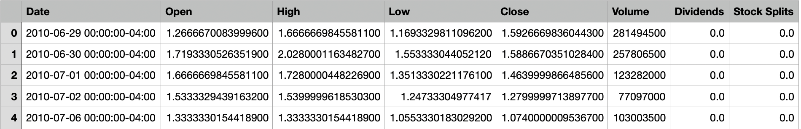

## Question 2(Tesla revenue):

- using web-scraping to extract Tesla revenue data

code:

```python
import requests
from bs4 import BeautifulSoup
import pandas as pd


def web_add():
    url = "https://www.macrotrends.net/stocks/charts/TSLA/tesla/revenue"
    web_res = requests.get(
        url=url,
        headers={
            "User-Agent": "Mozilla/5.0 (Macintosh; Intel Mac OS X 10_15_7) AppleWebKit/537.36 (KHTML, like Gecko) Chrome/126.1.0.0 Safari/537.36",
        }
    )
    # print(web_res.text)  # for checking web can use crawler or not

    # if having different encoding without utf-8
    web_res_dec = web_res.content.decode('utf-8')

    # Parse the HTML
    soup_object = BeautifulSoup(web_res_dec, "html.parser")

    # Find the specific "tag" by ID
    new_soup_object = soup_object.find(name="div", attrs={"id": "style-1"})

    # list objects in the target range
    li_area_obj_list = new_soup_object.find_all(name="tbody")
    target_data = []
    for li_obj in li_area_obj_list:
        td_obj = li_obj.find_all(name="td")
        for td_ele in td_obj:
            # print(td_ele.text)
            # we need to remove useless data from 2023 to 2009, total 30 data in the list
            # because the tags' names are the same, the target data must include useless data
            target_data.append(td_ele.text)
        # print("============")
    # create 2 lists for data and revenue
    count = 0
    date_list = []
    revenue_list = []
    for item in target_data:
        if count >= 30 and count % 2 == 0:
            date_list.append(item)
        elif count >= 30 and count % 2 == 1:
            revenue_list.append(item)
        count += 1
    # create a dictionary to store the data
    dict_data = {"date": date_list, "revenue": revenue_list}
    df = pd.DataFrame(dict_data)
    df.to_csv("tesla_revenue.csv", index=True)


if __name__ == "__main__":
    web_add()
```

**output:** (with .csv file type) (open with numbers)

the first / last 5 rows of the Tesla revenue

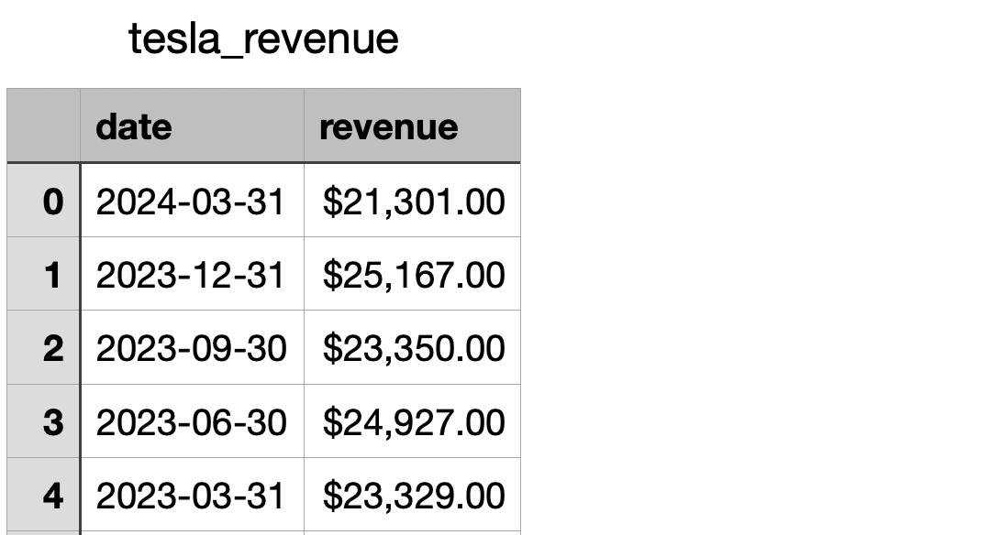

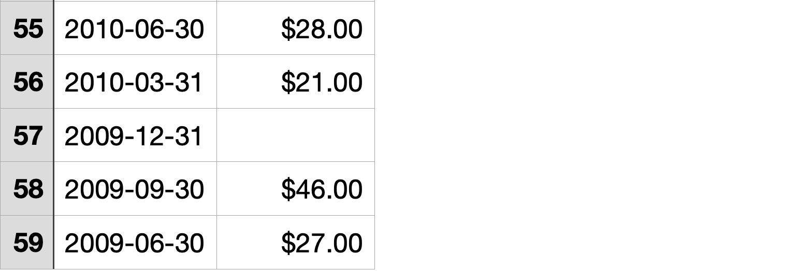

problem describing (the same tags issue):

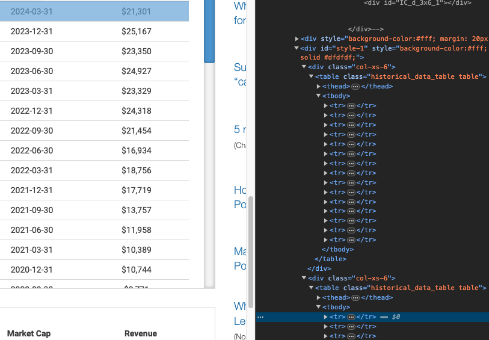

1. fining the "div" tag's "id", "style-1", using this to pinpoint the target range

2. minimizing the range by using "tbody" tag and "td" tags, which is under "tr" tags

3. the "td" tags are the smallest tags and including the info about date and revenue (2024-03-31 / $21,301)
   
   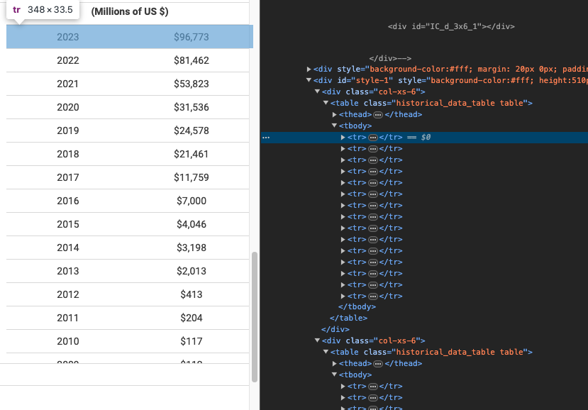

4. However, the data under the title (Millions of US $) are useless data for us (2023 / 96,773)

5. so, I use "count" in my code to refine "target_data" list (removing first 30 data)

## Question 3(GameStop data):

- using yfinance to extract GameStop historical stock data

code:

```python
import yfinance as yf


def gamestop_stock():
    gamestop = yf.Ticker('GME')
    gamestop_data = gamestop.history(period='max')
    gamestop_data.reset_index(inplace=True)
    print(gamestop_data.head())
    gamestop_data.to_csv('gamestop_data.csv')


if __name__ == '__main__':
    gamestop_stock()
```

**output:** (with .csv file type) (open with numbers)

the first 5 rows of the GameStop data

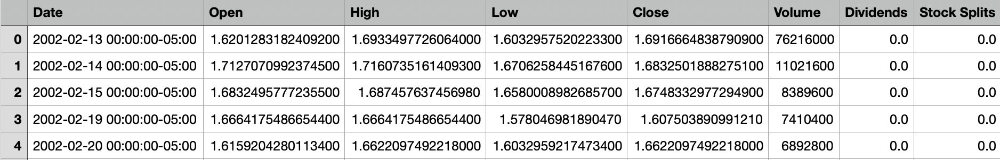

## Question 4(GameStop revenue):

- using web-scraping to extract GameStop revenue data

code:

```python
import requests
from bs4 import BeautifulSoup
import pandas as pd


def web_add():
    url = "https://www.macrotrends.net/stocks/charts/GME/gamestop/revenue"
    web_res = requests.get(
        url=url,
        headers={
            "User-Agent": "Mozilla/5.0 (Macintosh; Intel Mac OS X 10_15_7) AppleWebKit/537.36 (KHTML, like Gecko) Chrome/126.1.0.0 Safari/537.36",
        }
    )
    # print(web_res.text)  # for checking web can use crawler or not

    # if having different encoding without utf-8
    web_res_dec = web_res.content.decode('utf-8')

    # Parse the HTML
    soup_object = BeautifulSoup(web_res_dec, "html.parser")

    # Find the specific "tag" by ID
    new_soup_object = soup_object.find(name="div", attrs={"id": "style-1"})

    # list objects in the target range
    li_area_obj_list = new_soup_object.find_all(name="tbody")
    target_data = []
    for li_obj in li_area_obj_list:
        td_obj = li_obj.find_all(name="td")
        for td_ele in td_obj:
            # print(td_ele.text)
            # we need to remove useless data from 2023 to 2010, total 32 data in the list
            # because the tags' names are the same, the target data must include useless data
            target_data.append(td_ele.text)
        # print("============")
    # create 2 lists for data and revenue
    count = 0
    date_list = []
    revenue_list = []
    for item in target_data:
        if count >= 32 and count % 2 == 0:
            date_list.append(item)
        elif count >= 32 and count % 2 == 1:
            revenue_list.append(item)
        count += 1
    # create a dictionary to store the data
    dict_data = {"date": date_list, "revenue": revenue_list}
    df = pd.DataFrame(dict_data)
    df.to_csv("gamestop_revenue.csv", index=True)


if __name__ == "__main__":
    web_add()
```

**output:** (with .csv file type) (open with numbers)

the first / last 5 rows of the gamestop revenue

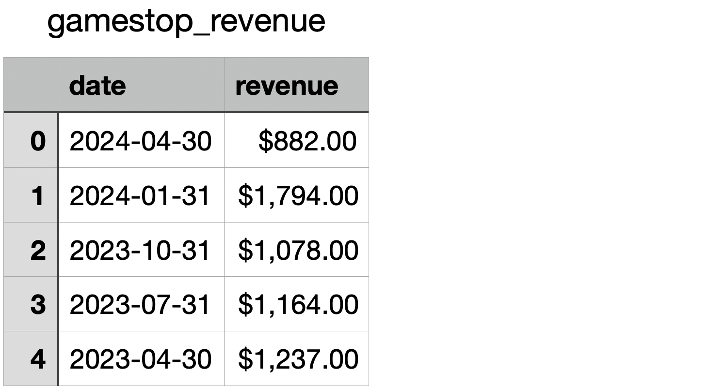

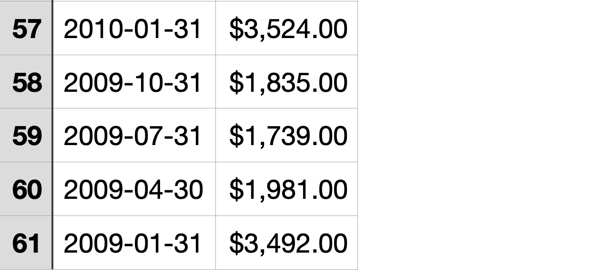

note: "target_data" would contain 32 useless data, so "count" needs to filter 32 data

## Question 5(Tesla stock graph):

- plot Tesla stock graph

- using the make_graph function to graph the Tesla stock data, also provide a title for the graph.

code: (note: combine with question 1 and 2)

```python
import requests
from bs4 import BeautifulSoup
import pandas as pd
import yfinance as yf
import plotly.graph_objects as go
from plotly.subplots import make_subplots


def tesla_stock():
    tesla = yf.Ticker('TSLA')
    tesla_data = tesla.history(period='max')
    tesla_data.reset_index(inplace=True)
    print(tesla_data.head())
    tesla_data.to_csv('tesla_data.csv')


def tesla_revenue():
    url = "https://www.macrotrends.net/stocks/charts/TSLA/tesla/revenue"
    web_res = requests.get(
        url=url,
        headers={
            "User-Agent": "Mozilla/5.0 (Macintosh; Intel Mac OS X 10_15_7) AppleWebKit/537.36 (KHTML, like Gecko) Chrome/126.1.0.0 Safari/537.36",
        }
    )
    # print(web_res.text)  # for checking web can use crawler or not

    # if having different encoding without utf-8
    web_res_dec = web_res.content.decode('utf-8')

    # Parse the HTML
    soup_object = BeautifulSoup(web_res_dec, "html.parser")

    # Find the specific "tag" by ID
    new_soup_object = soup_object.find(name="div", attrs={"id": "style-1"})

    # list objects in the target range
    li_area_obj_list = new_soup_object.find_all(name="tbody")
    target_data = []
    for li_obj in li_area_obj_list:
        td_obj = li_obj.find_all(name="td")
        for td_ele in td_obj:
            # print(td_ele.text)
            # we need to remove useless data from 2023 to 2009, total 30 data in the list
            # because the tags' names are the same, the target data must include useless data
            target_data.append(td_ele.text)
        # print("============")
    # create 2 lists for data and revenue
    count = 0
    date_list = []
    revenue_list = []
    for item in target_data:
        if count >= 30 and count % 2 == 0:
            date_list.append(item)
        elif count >= 30 and count % 2 == 1:
            revenue_list.append(item)
        count += 1
    # create a dictionary to store the data
    dict_data = {"date": date_list, "revenue": revenue_list}
    df = pd.DataFrame(dict_data)
    df.to_csv("tesla_revenue.csv", index=True)


def make_graph(stock_file, revenue_file, stock):
    # Load data from .csv files
    stock_data = pd.read_csv(stock_file)
    revenue_data = pd.read_csv(revenue_file)

    # this line is to convert $21301(string) to 21301(float) # if necessory
    revenue_data['revenue'] = revenue_data['revenue'].replace('[\$,]', '', regex=True).astype(float)

    # Create a subplot figure , rows have price(close)(in stock_data) and revenue(revenue)(in revenue_data)
    # column has 1 (date)(in both files)
    fig = make_subplots(rows=2, cols=1, shared_xaxes=True, subplot_titles=("Historical Share Price", "Historical Revenue"), vertical_spacing=0.3)

    # Add the stock data trace. make sure ['Date'] and ['Close'] must be the same with the rows names in the files
    # y-axis must be the type float. if not, changing it or code will error
    # name= "can re-name what you want". just make sure it is relative with data
    fig.add_trace(go.Scatter(x=pd.to_datetime(stock_data['Date'], infer_datetime_format=True),
                             y=stock_data['Close'].astype(float),
                             name="Share Price"),
                  row=1, col=1)

    # Add the revenue data trace. make sure ['date'] and ['revenue'] must be the same with the rows names in the files
    fig.add_trace(go.Scatter(x=pd.to_datetime(revenue_data['date'], infer_datetime_format=True),
                             y=revenue_data['revenue'].astype(float),
                             name="Revenue"),
                  row=2, col=1)

    # Update x-axis and y-axis labels.
    # title_text= "can re-name what you want". just make sure it is relative with graph
    fig.update_xaxes(title_text="Date", row=1, col=1)
    fig.update_xaxes(title_text="Date", row=2, col=1)
    fig.update_yaxes(title_text="Price ($)", row=1, col=1)
    fig.update_yaxes(title_text="Revenue ($ Millions)", row=2, col=1)

    # Update the layout and show the plot
    fig.update_layout(showlegend=True, height=900, title=stock + ' Financial Data', xaxis_rangeslider_visible=True)
    fig.show()


if __name__ == "__main__":
    stock = tesla_stock()
    revenue = tesla_revenue()
    make_graph('tesla_data.csv', 'tesla_revenue.csv', 'Tesla')
```

**output**:

1. demo in web 127.0.0.1 because i didn't use Jupyter Notebook

2. using PyCharm to do the analysis

3. the results are the same

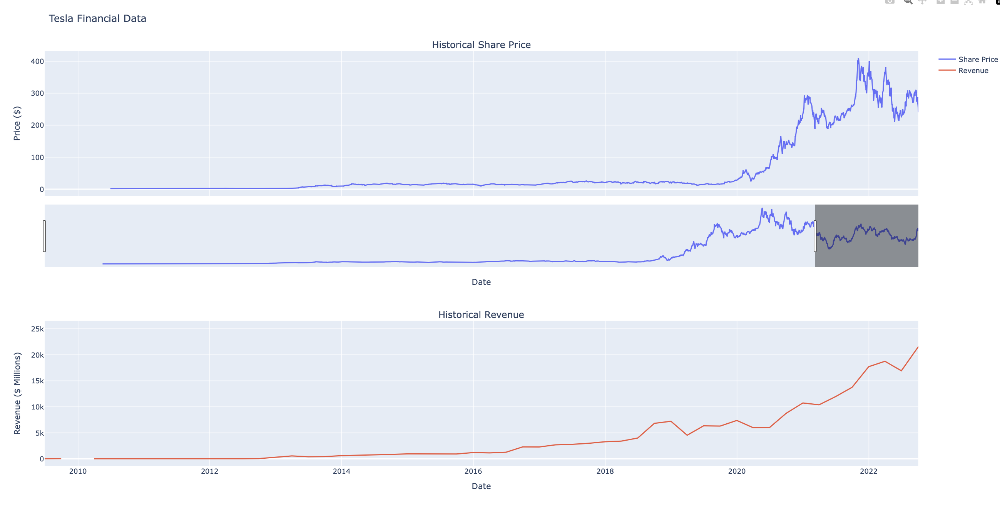

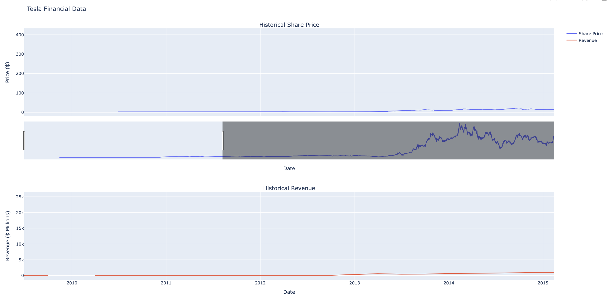

## Question 6(GameStop stock graph):

- plot GameStop stock graph

- using the make_graph function to graph the GameStop stock data, also provide a title for the graph.

code: (note: combine with question 3 and 4)

```python
import requests
from bs4 import BeautifulSoup
import pandas as pd
import yfinance as yf
import plotly.graph_objects as go
from plotly.subplots import make_subplots


def gamestop_stock():
    gamestop = yf.Ticker('GME')
    gs_stock = gamestop.history(period='max')
    gs_stock.reset_index(inplace=True)
    print(gs_stock.head())
    gs_stock.to_csv('gamestop_data.csv')


def gamestop_revenue():
    url = "https://www.macrotrends.net/stocks/charts/GME/gamestop/revenue"
    web_res = requests.get(
        url=url,
        headers={
            "User-Agent": "Mozilla/5.0 (Macintosh; Intel Mac OS X 10_15_7) AppleWebKit/537.36 (KHTML, like Gecko) Chrome/126.1.0.0 Safari/537.36",
        }
    )
    # print(web_res.text)  # for checking web can use crawler or not

    # if having different encoding without utf-8
    web_res_dec = web_res.content.decode('utf-8')

    # Parse the HTML
    soup_object = BeautifulSoup(web_res_dec, "html.parser")

    # Find the specific "tag" by ID
    new_soup_object = soup_object.find(name="div", attrs={"id": "style-1"})

    # list objects in the target range
    li_area_obj_list = new_soup_object.find_all(name="tbody")
    target_data = []
    for li_obj in li_area_obj_list:
        td_obj = li_obj.find_all(name="td")
        for td_ele in td_obj:
            # print(td_ele.text)
            # we need to remove useless data from 2023 to 2009, total 30 data in the list
            # because the tags' names are the same, the target data must include useless data
            target_data.append(td_ele.text)
        # print("============")
    # create 2 lists for data and revenue
    count = 0
    date_list = []
    revenue_list = []
    for item in target_data:
        if count >= 32 and count % 2 == 0:
            date_list.append(item)
        elif count >= 32 and count % 2 == 1:
            revenue_list.append(item)
        count += 1
    # create a dictionary to store the data
    dict_data = {"date": date_list, "revenue": revenue_list}
    gs_revenue = pd.DataFrame(dict_data)
    gs_revenue.to_csv("gamestop_revenue.csv", index=True)


def make_graph(stock_file, revenue_file, stock):
    # Load data from .csv files
    stock_data = pd.read_csv(stock_file)
    revenue_data = pd.read_csv(revenue_file)

    # this line is to convert $882(string) to 882(float) # if necessory
    revenue_data['revenue'] = revenue_data['revenue'].replace('[\$,]', '', regex=True).astype(float)

    # Create a subplot figure , rows have price(close)(in stock_data) and revenue(revenue)(in revenue_data)
    # column has 1 (date)(in both files)
    fig = make_subplots(rows=2, cols=1, shared_xaxes=True, subplot_titles=("Historical Share Price", "Historical Revenue"), vertical_spacing=0.3)

    # Add the stock data trace. make sure ['Date'] and ['Close'] must be the same with the rows names in the files
    # y-axis must be the type float. if not, changing it or code will error
    # name= "can re-name what you want". just make sure it is relative with data
    fig.add_trace(go.Scatter(x=pd.to_datetime(stock_data['Date'], infer_datetime_format=True),
                             y=stock_data['Close'].astype(float),
                             name="Share Price"),
                  row=1, col=1)

    # Add the revenue data trace. make sure ['date'] and ['revenue'] must be the same with the rows names in the files
    fig.add_trace(go.Scatter(x=pd.to_datetime(revenue_data['date'], infer_datetime_format=True),
                             y=revenue_data['revenue'].astype(float),
                             name="Revenue"),
                  row=2, col=1)

    # Update x-axis and y-axis labels.
    # title_text= "can re-name what you want". just make sure it is relative with graph
    fig.update_xaxes(title_text="Date", row=1, col=1)
    fig.update_xaxes(title_text="Date", row=2, col=1)
    fig.update_yaxes(title_text="Price ($)", row=1, col=1)
    fig.update_yaxes(title_text="Revenue ($ Millions)", row=2, col=1)

    # Update the layout and show the plot
    fig.update_layout(showlegend=True, height=900, title=stock + ' Financial Data', xaxis_rangeslider_visible=True)
    fig.show()


if __name__ == "__main__":
    stock = gamestop_stock()
    revenue = gamestop_revenue()
    make_graph('gamestop_data.csv', 'gamestop_revenue.csv', 'GameStop')
```

**output**: 

1. demo in web 127.0.0.1 because i didn't use Jupyter Notebook

2. using PyCharm to do the analysis

3. the results are the same

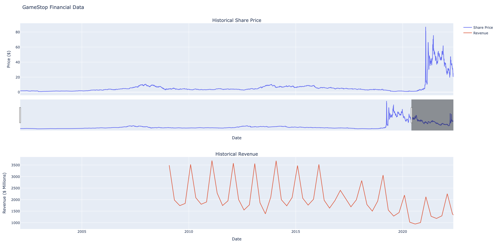

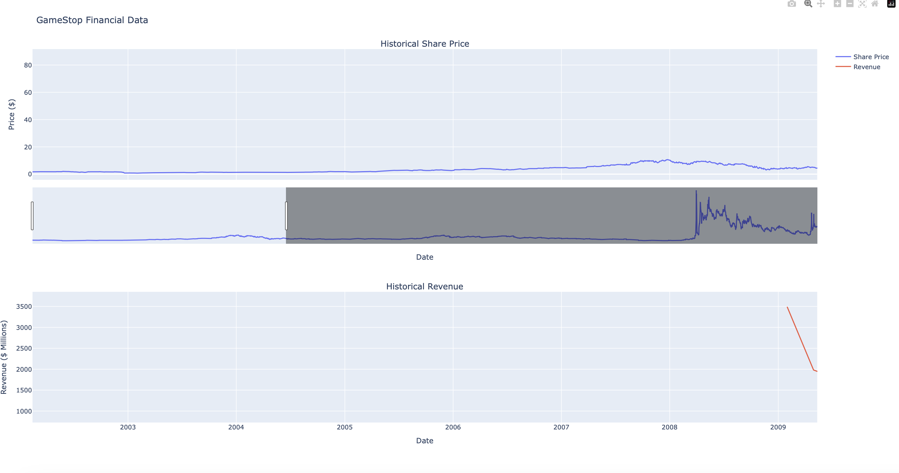
